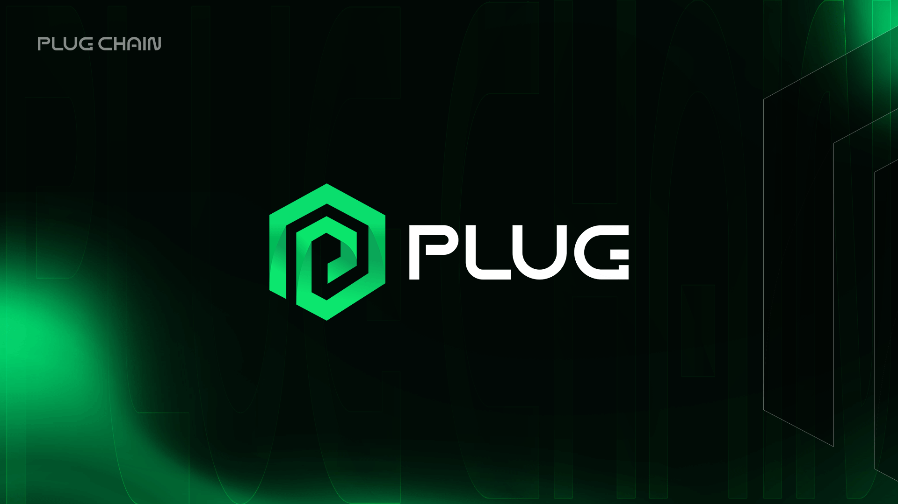

  <h1>Cosmos Hub Plug Chain </h1>

 

  
  
   
    
     

This repository hosts `plugchain`, the implementation of the Plug Chain based on the [Cosmos SDK 0.42.4](https://github.com/cosmos/cosmos-sdk).

**[info]**: Requires [Go 1.16](https://golang.org/dl/)

## Getting Started
* See the [Getting Started Docs](https://oraclenetworkprotocol.github.io/plugchain/) for instructions how to install and run the blockchain.
* [Chengdu community contribution Docs](https://shimo.im/docs/pp38QGQVWyhXHkjg/read)

## Change

Change log records and contents corresponding to different versions [changelog](CHANGELOG.md)

## Talk to us!

We have active, helpful communities on Twitter, Discord, and Telegram.

* [Facebook](https://www.facebook.com/profile.php?id=100068750358187)
* [Twitter](https://mobile.twitter.com/Plugchainclub)
* [Telegram](https://t.me/plugchain)

## Testnet Status
[Test process document](https://oraclenetworkprotocol.github.io/plugchain/get-started/testnet.html)
