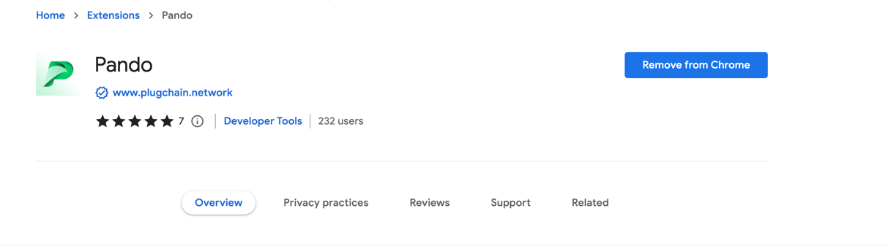
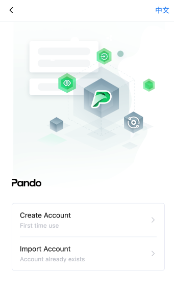
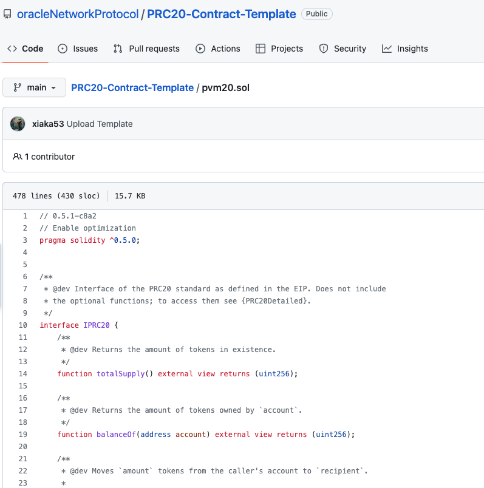
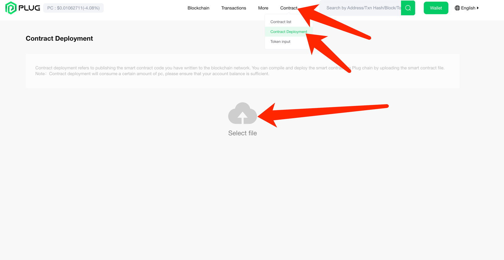
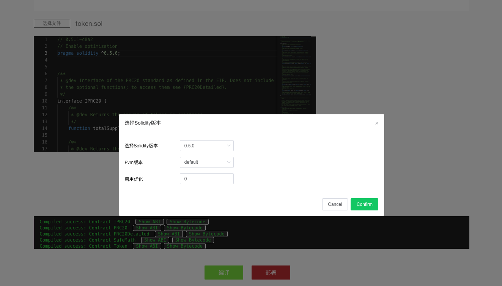
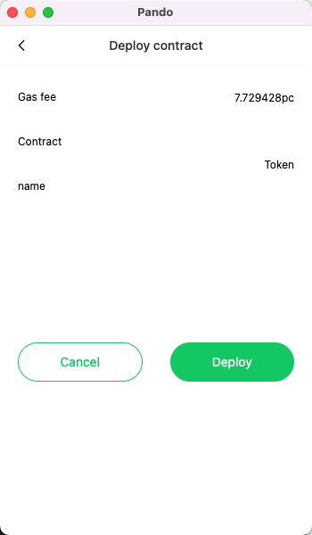
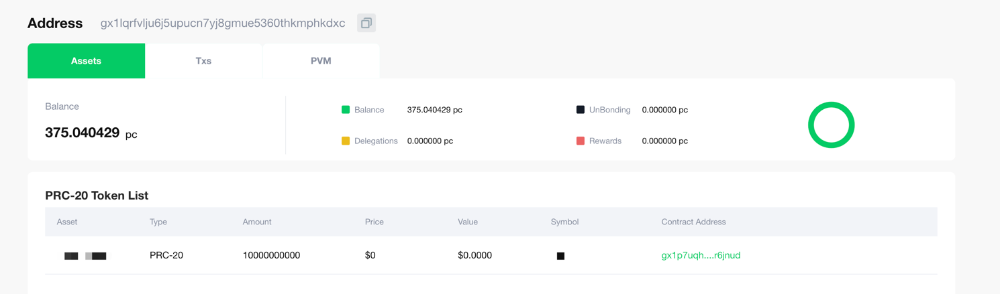

# Browser: Deploy smart contracts

### 1. Install Pando Chrome plugin wallet
- Search in chrome google store`pando`

### 2. Create or import an account in the wallet
- By importing or creating an account, and ensuring that there is enough** balance** in the account, it is used to guarantee the handling fee for issuing the contract

### 3. Prepare ERC20 contract code file
- [code example](https://github.com/oracleNetworkProtocol/PRC20-Contract-Template/blob/main/pvm20.sol)

- You can modify your** Token Name, Token Symbol, Precision** at the bottom of the code
    ```sol
    /**
    * @title SimpleToken
    * @dev Very simple PRC20 Token example, where all tokens are pre-assigned to the creator.
    * Note they can later distribute these tokens as they wish using `transfer` and other
    * `PRC20` functions.
    */
    contract Token is PRC20, PRC20Detailed {

        /**
        * @dev Constructor that gives msg.sender all of existing tokens.
        */
        constructor () public PRC20Detailed("YourTokenName", "YourTokenSymbol", 18) {
            _mint(msg.sender, 10000000000 * (10 ** uint256(decimals())));
        }
    }
    ```
### 4. Deploy smart contracts
- Enter the browser [www.plugchain.network](https://www.plugchain.network/v2) Select** Contract --> Contract Deployment --> Upload Contract File**

### 5. Compile the deploy contract
- After upload is complete 
    - Select the `Solidity` version number to match your version
    - Select  the`EVM`version,nothing special, just select the default
    - Whether to enable optimization,` 0`is not enabled,` 1-999999999`is enabled

- After the compilation is successful, there is a green font below, the word `Compiled success`
- Click`confirm`,select the corresponding contract name,in the example is `Token` , confirm to initiate wallet authorization, initiate transaction


### 6. Copy HASH to view transaction information
- After the transaction is successful, check the address information of the released contract to see that the token information we have released already exists.

