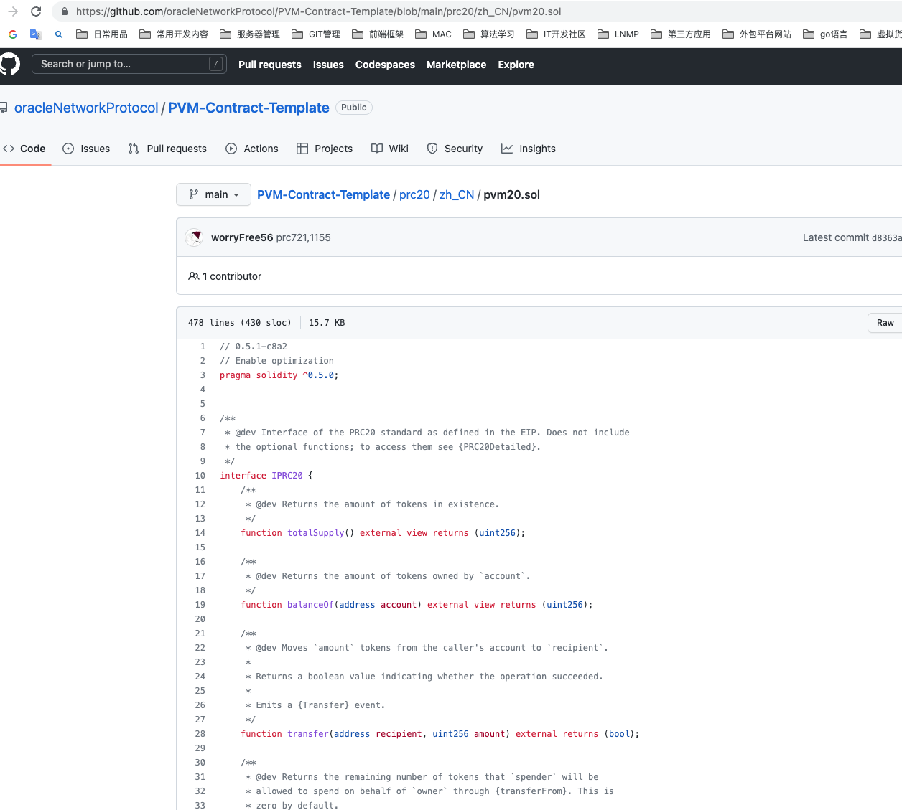

# 浏览器: 部署智能合约

### 1. 安装 Pando Chrome 插件钱包
- 在chrome谷歌商店搜索`pando`

### 2. 在钱包中创建或导入账户
- 通过导入或者创建PRC-20账户,并且保证PRC-20账户中有足够的 **余额** ,用于保证发行合约的手续费

### 3. 准备ERC-20的合约代码文件
- [代码示例](https://github.com/oracleNetworkProtocol/PVM-Contract-Template/blob/main/prc20/zh_CN/pvm20.sol)

- 在代码的最下方可修改你的 **代币名称,代币符号,精度**
    ```sol
    /**
    * @title SimpleToken
    * @dev Very simple PRC20 Token example, where all tokens are pre-assigned to the creator.
    * Note they can later distribute these tokens as they wish using `transfer` and other
    * `PRC20` functions.
    */
    contract Token is PRC20, PRC20Detailed {

        /**
        * @dev Constructor that gives msg.sender all of existing tokens.
        */
        constructor () public PRC20Detailed("YourTokenName", "YourTokenSymbol", 18) {
            _mint(msg.sender, 10000000000 * (10 ** uint256(decimals())));
        }
    }
    ```
### 4. 部署智能合约
- 进入浏览器 [www.plugchain.network](https://www.plugchain.network/v2) 选择 **合约 --> 合约部署 --> 上传合约文件**

### 5. 编译部署合约
- 上传完成后 
    - 选择`Solidity`版本号,和你的版本保持一致
    - 选择`EVM`版本,无特殊选择默认即可
    - 是否启用优化, `0`  不启用, 启用 `1-999999999` 

- 编译成功后下方有上图中的绿色字体,`Compiled success`字样
- 点击`confirm`,选择对应的合约名称,示例里面是 `Token` ,确认发起钱包授权,发起交易


### 6. 复制HASH查看交易信息
- 交易成功后,查看发布合约的地址信息能看到已经有了我们发布的代币信息

